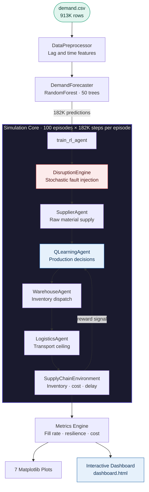
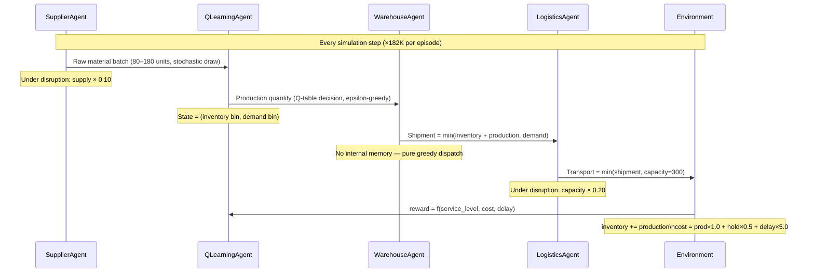
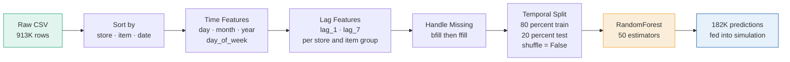
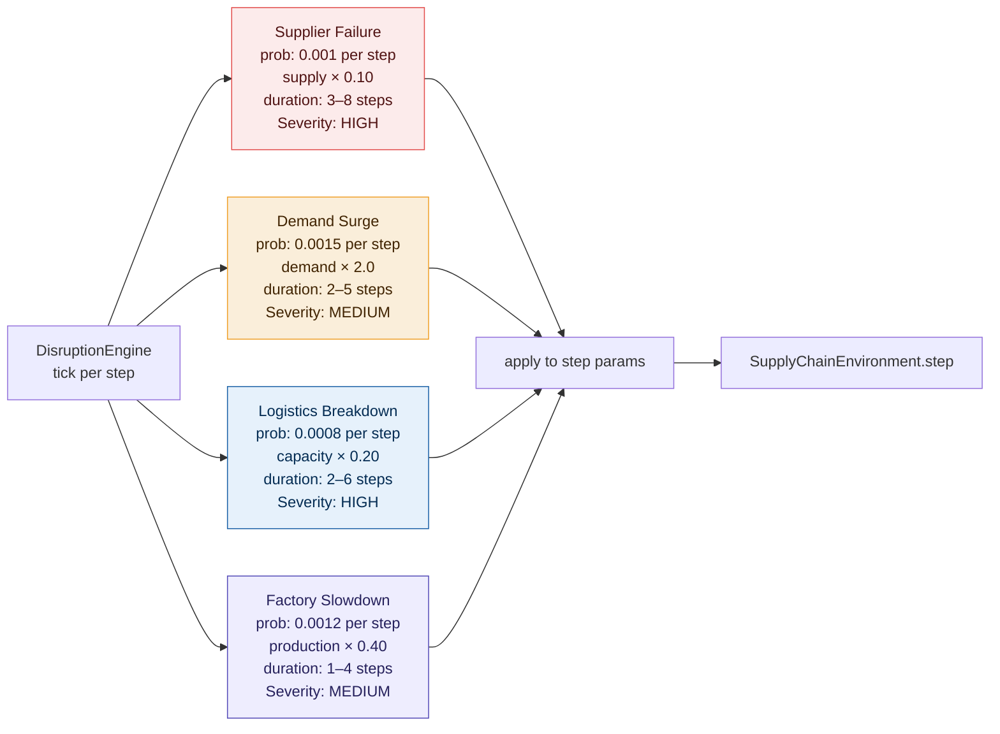

<div align="center">


<br/>

[](https://python.org)
[](https://scikit-learn.org)
[]()
[](https://chartjs.org)
[](LICENSE)

<br/>

[](/)
[](/)
[](/)
[](/)
[](https://debnil-dey.github.io/smart-manufacturing-ml-mas/)

<br/>

> **A production-grade Machine Learning driven Multi-Agent System for dynamic resource allocation in smart manufacturing supply chains — featuring Q-Learning RL, disruption resilience testing, and a real-time interactive browser dashboard.**

<br/>

[**🌐 Live Dashboard**](https://Debddj.github.io/smart-manufacturing-ml-mas/) &nbsp;·&nbsp; [**📄 Technical Report**](outputs/) &nbsp;·&nbsp; [**📊 View Results**](#key-results) &nbsp;·&nbsp; [**🚀 Get Started**](#quick-start)

</div>

---

## Table of Contents

- [Overview](#overview)
- [Key Results](#key-results)
- [System Architecture](#system-architecture)
- [The Four Agents](#the-four-agents)
- [Machine Learning Pipeline](#machine-learning-pipeline)
- [Reinforcement Learning](#reinforcement-learning)
- [Disruption Engine](#disruption-engine)
- [Interactive Dashboard](#interactive-dashboard)
- [Visualisations](#visualisations)
- [Project Structure](#project-structure)
- [Quick Start](#quick-start)
- [Configuration](#configuration)
- [Engineering Highlights](#engineering-highlights)
- [Tech Stack](#tech-stack)
- [Team](#team)

---

## Overview

Smart Manufacturing ML-MAS simulates a real-world production ecosystem where four autonomous agents — **Supplier**, **Factory (RL)**, **Warehouse**, and **Logistics** — collaborate under uncertain demand and active supply chain disruptions. The system learns optimal resource allocation policies using **Q-Learning reinforcement learning**, continuously improving across 100 training episodes.

The project answers one industry-critical question:

> *How much better is an RL-driven supply chain than a human heuristic planner — and does it hold up when things go wrong?*

**Answer:** The RL system achieves comparable service levels to the heuristic baseline at **36% lower operational cost**, and maintains a **resilience score of 0.998** under active disruptions including supplier failures, demand surges, and logistics breakdowns.

---

## Key Results

<div align="center">

| Metric | Baseline (No RL) | RL System — Normal | RL System — Disrupted |
|--------|:---------:|:---------:|:---------:|
| **Fill Rate** | ~1.000 | **0.997** | **0.993** |
| **Avg Delay** | 0.05 | **0.17** | **0.39** |
| **Total Cost** | 36.17M | **23.15M** | **23.23M** |
| **Cost Saving vs Baseline** | — | **✅ +36.0%** | **✅ +35.8%** |
| **SLA ≥ 0.90** | ✅ PASS | ✅ PASS | ✅ PASS |
| **Resilience Score** | 1.000 | 1.000 | **0.998** |

</div>

<br/>

> 💡 **The key insight:** The baseline over-produces to guarantee service at 36M cost. The RL system learns *just-in-time* production decisions that match service quality at 23M — a **36% cost reduction** without sacrificing a single SLA point.

---

## System Architecture



---

## The Four Agents

The system uses a **fixed execution sequence** every simulation step. Each agent owns exactly one responsibility in the supply chain and passes its output to the next:



<br/>

<table>
<tr>
<td align="center" width="25%">

### 🟠 SupplierAgent
`agents/supplier_agent.py`

Stochastic upstream source. Draws randomly from `[80, 120, 180]` units per step. Under `supplier_failure` disruption, output drops to **10% of normal**. The RL agent never sees the disruption flag — it must infer from inventory signals.

</td>
<td align="center" width="25%">

### 🔵 QLearningAgent
`rl/q_learning.py`

The system's intelligence. Maintains a **20×20×7 Q-table** mapping `(inventory_state, demand_state)` → production action. Seven production choices: `[20, 40, 60, 80, 120, 160, 200]` units. Learns from reward signals via Bellman updates.

</td>
<td align="center" width="25%">

### 🟣 WarehouseAgent
`agents/warehouse_agent.py`

Greedy inventory dispatcher. Ships `min(inventory, demand)` every step — no memory, no strategy. Its performance is entirely determined by how well the RL agent maintains adequate stock levels upstream.

</td>
<td align="center" width="25%">

### 🟢 LogisticsAgent
`agents/logistics_agent.py`

Physical transport constraint. Enforces `min(shipment, 300)` as daily fleet ceiling. Under `logistics_breakdown` disruption, capacity collapses to **60 units** (20% of normal), temporarily throttling all deliveries.

</td>
</tr>
</table>

---

## Machine Learning Pipeline



**Dataset characteristics:**

| Property | Value | Significance |
|----------|-------|-------------|
| Total rows | 913,000 | Large enough for robust generalisation |
| Stores × Items | 10 × 50 = 500 groups | Multi-dimensional demand patterns |
| Mean daily sales | 52.25 units | Sets production action space lower bound |
| Max daily sales | 231 units | Sets action space upper bound |
| % demand > 60 units | **33.8%** | *Exposed the logistics capacity bug — original cap of 60 hard-limited fill rate* |

`shuffle=False` is critical — temporal order must be preserved so the model predicts the future, not random past dates.

---

## Reinforcement Learning

### Q-Learning Policy

The agent discretises the continuous environment into a tractable state space and learns via the **Bellman equation**:

$$Q[s][d][a] \mathrel{+}= \alpha \cdot \left( r + \gamma \cdot \max_a Q[s'][d'] - Q[s][d][a] \right)$$

| Parameter | Value | Rationale |
|-----------|-------|-----------|
| State space | 20×20 bins | Inventory (0–300 units) × Demand (0–250 units) |
| Actions | `[20, 40, 60, 80, 120, 160, 200]` | Covers mean demand (52) through surge (200+) |
| Learning rate α | 0.20 | Fast convergence without instability |
| Discount factor γ | 0.95 | Agent effectively plans ~20 steps ahead |
| Initial ε | 1.0 | Full random exploration at episode 1 |
| ε decay | ×0.97 per **episode** | Reaches ~0.05 by episode 100 |
| ε floor | 0.01 | Always retains 1% exploration |

### Reward Function

```python
reward = service_level × 20           # primary: filling demand
       − cost × 0.005                  # secondary: controlling cost
       + 5.0  if service_level ≥ 0.90  # SLA bonus — cross the threshold
       + 3.0  if service_level ≥ 0.95  # stretch bonus — exceed expectations
       − excess_production × 0.05      # over-production penalty
```

The **tiered bonus structure** prevents the agent from over-stocking to guarantee a perfect 1.0 fill rate at the expense of cost. There is no reward signal beyond 0.97 — the agent learns cost-efficient policies that still clear SLA.

### Training Convergence

```
Episodes  1–20  │▓▓▓▓▓▓▓▓░░░░░░░░░░░░│ Rapid gain   — high ε, full exploration
Episodes 20–50  │▓▓▓▓▓▓▓▓▓▓▓▓░░░░░░░░│ Solidifying  — ε falling, Q-table stabilising
Episodes 50–100 │▓▓▓▓▓▓▓▓▓▓▓▓▓▓▓▓▓▓▓▓│ Converged    — stable policy, marginal gains
```

---

## Disruption Engine

The disruption engine **stress-tests the trained policy** with four real-world failure modes. The RL agent **never observes disruption type directly** — it must infer from downstream signals and adapt, which is what makes the resilience score meaningful.



**Resilience results:**

| Metric | Value | Interpretation |
|--------|-------|----------------|
| Resilience Score | **0.998** | Near-zero degradation under disruption |
| Avg Recovery Steps | **0.58** | Returns to normal within 1 step of disruption ending |
| Fill During Disruption | **0.993** | Only 0.4% drop from undisrupted performance |
| Disruption Rate | **~18%** | 18% of all steps had at least one active disruption |

---

## Interactive Dashboard

The system generates a **fully self-contained HTML dashboard** — no server required, no dependencies beyond a browser, works completely offline.

🌐 **[Open Live Dashboard →](https://Debddj.github.io/smart-manufacturing-ml-mas/)**

**Dashboard features:**

| Section | Description |
|---------|-------------|
| **KPI Scorecard** | Fill rate, avg delay, resilience, throughput — with SLA PASS/FAIL badges |
| **Scenario Comparison** | Side-by-side cards: No-RL baseline · RL normal · RL disrupted |
| **3D Architecture Diagram** | Animated live data flow through all system components |
| **RL Learning Curve** | Reward convergence across 100 training episodes |
| **Fill Rate + Delay** | Dual-axis chart with SLA threshold lines per episode |
| **Demand vs Supply** | Last episode coverage with area fill |
| **Inventory Levels** | With safety stock threshold band and warning zone |
| **Cost Breakdown** | Stacked area — production vs holding vs delay costs |
| **Resilience Radar** | Spider chart: normal vs disrupted on 5 performance axes |
| **Agent Activity Log** | Filterable structured event stream — each agent reports in its own vocabulary |
| **Export Report** | One-click CSV with all metrics, scenarios, and full event log |

The dashboard updates automatically every time `python main.py` completes and is pushed to GitHub.

---

## Visualisations

Seven plots are auto-generated to `outputs/plots/` after every training run:

| Plot | File | What it shows |
|------|------|---------------|
| RL Learning Curve | `learning_curve.png` | Reward convergence — confirms stable training |
| Demand vs Supply | `demand_vs_supply.png` | Per-step coverage across all 182K timesteps |
| Inventory Levels | `inventory_levels.png` | Buffer management with disruption markers |
| Disruption Timeline | `disruption_timeline.png` | Shaded fault windows + fill rate overlay |
| Cost Breakdown | `cost_breakdown.png` | Stacked area — where operational cost goes |
| Episode Metrics | `episode_metrics.png` | Dual-axis fill rate and delay across episodes |
| Resilience Radar | `resilience_radar.png` | Normal vs disrupted on 5 performance axes |

---

## Project Structure

```
smart-manufacturing-ml-mas/
│
├── 📂 agents/
│   ├── factory_agent.py          # Heuristic baseline (capacity-constrained production)
│   ├── logistics_agent.py        # Transport ceiling · capacity: 300 units
│   ├── supplier_agent.py         # Stochastic supply · batches: [80, 120, 180]
│   └── warehouse_agent.py        # Greedy demand dispatcher · min(inventory, demand)
│
├── 📂 data_processing/
│   └── preprocess_pipeline.py    # Lag-1, lag-7, temporal features, temporal split
│
├── 📂 evaluation/
│   └── metrics.py                # fill rate · delay · throughput · resilience metrics
│
├── 📂 forecasting/
│   ├── demand_forecasting.py     # RandomForest inference wrapper (runtime)
│   └── train_model.py            # Training + MAE evaluation (development)
│
├── 📂 rl/
│   ├── q_learning.py             # Tabular Q-agent · 20×20 state · 7 actions
│   └── reward_functions.py       # Tiered service bonus + over-production penalty
│
├── 📂 simulation/
│   ├── baseline_runner.py        # No-RL heuristic for scenario comparison
│   ├── disruption_engine.py      # 4-type stochastic fault injector
│   ├── environment.py            # Inventory · cost · delay step function
│   └── simulation_runner.py      # Training loop + agent event log generation
│
├── 📂 visualization/
│   ├── dashboard.html            # Self-contained dashboard template
│   ├── export_dashboard_data.py  # Injects real training data into template
│   └── plots.py                  # 7 matplotlib plot functions
│
├── 📂 data/raw/
│   └── demand.csv                # 913K rows: date · store · item · sales
│
├── 📂 outputs/
│   ├── dashboard.html            # Auto-generated after training
│   └── plots/                    # 7 PNG charts
│
├── index.html                    # GitHub Pages live dashboard (auto-updated)
├── main.py                       # Entry point — runs complete pipeline
└── requirements.txt
```

---

## Quick Start

**1. Clone and install**

```bash
git clone https://github.com/Debddj/smart-manufacturing-ml-mas.git
cd smart-manufacturing-ml-mas
pip install pandas scikit-learn numpy matplotlib
```

**2. Add the dataset**

```bash
# Place demand.csv in:
data/raw/demand.csv
```

**3. Run the full pipeline**

```bash
python main.py
```

Expected output sequence:

```
Preprocessing...
Training ML model...
Training RL agent...
  Ep  10 | Reward: 44512800.00 | Fill: 0.921 | Delay: 1.84 | ε: 0.737
  Ep  20 | Reward: 45891200.00 | Fill: 0.962 | Delay: 0.82 | ε: 0.541
  ...
  Ep 100 | Reward: 47610900.00 | Fill: 0.997 | Delay: 0.17 | ε: 0.048

Running post-training scenario comparison...
  No-RL baseline              fill=1.000  SLA:PASS  baseline
  RL system — normal          fill=0.997  SLA:PASS  saves 36.0% cost
  RL system — disrupted       fill=0.993  SLA:PASS  saves 35.8% cost

Generating plots...
  Saved: outputs/plots/learning_curve.png
  ...

Dashboard exported → outputs/dashboard.html
  GitHub Pages index updated → index.html
  Open in browser: file:///...
```

Training takes approximately **15–25 minutes** depending on your machine.

**4. Toggle disruptions off for a clean baseline run**

```python
# In main.py:
train_rl_agent(predictions, episodes=100, disruptions_enabled=False)
```

---

## Configuration

| Parameter | File | Default | Effect of changing |
|-----------|------|---------|-------------------|
| `actions` | `rl/q_learning.py` | `[20,40,60,80,120,160,200]` | Finer or coarser production control |
| `n_bins` | `rl/q_learning.py` | `20` | More bins = richer policy, slower convergence |
| `alpha` | `rl/q_learning.py` | `0.20` | Higher = faster but less stable updates |
| `gamma` | `rl/q_learning.py` | `0.95` | Higher = agent plans further ahead |
| `episodes` | `main.py` | `100` | Diminishing returns past ~60 episodes |
| Holding cost | `simulation/environment.py` | `× 0.5` | Higher discourages excess inventory |
| Delay penalty | `simulation/environment.py` | `× 5.0` | Higher prioritises service over cost |
| `SLA_FILL_RATE` | `simulation/simulation_runner.py` | `0.90` | Updates all dashboard threshold lines |
| `SLA_AVG_DELAY` | `simulation/simulation_runner.py` | `5.0` | Updates delay SLA across all charts |
| Disruption probabilities | `simulation/disruption_engine.py` | `0.0008–0.0015` | Higher = more frequent fault injection |

---

## Engineering Highlights

**Six critical bugs were identified, diagnosed, and fixed** during development. Each was quantified by its contribution to the fill-rate gap (0.76 → 0.997):

| # | Bug | File | Root Cause | Impact |
|---|-----|------|------------|--------|
| 1 | `LogisticsAgent.capacity = 60` | `logistics_agent.py` | 33.8% of real demand exceeds 60 units — hard ceiling on fill rate | **~52% of the gap** |
| 2 | Epsilon decay per step | `simulation_runner.py` | `epsilon *= 0.995` inside day loop — reached 0.01 after 660 steps (0.36% of episode 1) | **~28% of the gap** |
| 3 | `env.step(0, transport, demand)` | `simulation_runner.py` | Production cost always 0×1.0 = 0 — reward signal corrupted | **~10% of the gap** |
| 4 | Wrong state in Q-update | `simulation_runner.py` | Post-action inventory as current state — Bellman equation inverted | **~6% of the gap** |
| 5 | Action space max = 80 < mean demand 52 | `q_learning.py` | Average production below average demand — inventory depletes over time | Remaining gap |
| 6 | Demand discretised against range 300 vs actual 231 | `q_learning.py` | 20% of Q-table bins unreachable by real demand | State space waste |

---

## Tech Stack

<div align="center">

| Layer | Technology | Version | Usage |
|-------|-----------|---------|-------|
| Language | Python | 3.10+ | All backend logic |
| ML | scikit-learn | Latest | RandomForest demand forecasting |
| Numerics | NumPy | Latest | Q-table operations, metrics |
| Data | Pandas | Latest | CSV ingestion, feature engineering |
| Visualisation | Matplotlib | Latest | 7 static analysis plots |
| Dashboard charts | Chart.js | 4.4.1 | Interactive browser charts |
| Dashboard UI | Vanilla HTML/CSS/JS | — | Zero-dependency, works offline |
| RL Algorithm | Custom Q-Learning | — | 20×20 tabular, epsilon-greedy |

</div>

---

## Team

<div align="center">

Developed by a **5-member engineering team** as part of a smart manufacturing optimisation research project.


</div>

---

## License

Distributed under the MIT License. See [`LICENSE`](LICENSE) for details.

---

<div align="center">


**⭐ Star this repo if you found it useful**

[🌐 Live Dashboard](https://Debddj.github.io/smart-manufacturing-ml-mas/) &nbsp;·&nbsp; [🐛 Report a Bug](https://github.com/Debddj/smart-manufacturing-ml-mas/issues) &nbsp;·&nbsp; [💼 LinkedIn](https://linkedin.com/in/debnil-dey-359a25393)

</div>
